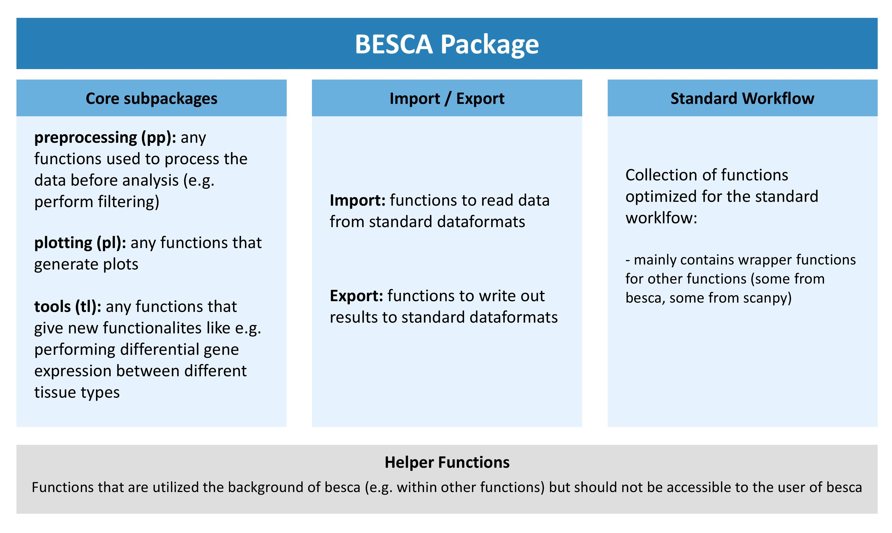

.. _adding-new-functions:

=============================
adding new functions to besca
=============================

We look forward to having all of your useful python functions/scripts for scRNA seq analysis included in besca. Since most of the documentation for this package is generated automatically this documentation will walk you through properly annotating your function for inclusion in besca. You will also find information on how to include example output from your function or additional text.

.. _finding-the-right-place-for-functions:

------------------------------------------------------
finding the right place for your function within besca
------------------------------------------------------

The besca package has been divided into three main submodules and additional supporting modules. The core subpackages contain useful functions for scRNA seq analysis, the import/export submodules contain functions to read and write data using our FAIR file formats, and the standard workflow subpackage only contains functions that have been specifically optimized for use in our standard processing pipeline.

Depending on what your function does you will need to include it in the correct subarea of besca. The graphic outline of the besca package above gives you a rough idea of where it might make sense to include your package. If in doubt, discuss with your colleagues.

.. _besca-include-function-correct-location:

----------------------------------------------------
how to include your function in your chosen location
----------------------------------------------------

.. sidebar:: Example

    for a function called :code:`add_plot` contained in the file :code:`_plotting_functions.py` under the submodule plotting you would open plotting's :code:`__init__.py` file (contained in the pl folder in the main besca code directory) and append :code:`from _plotting_functions` :code:`import add_plot`. If you wished to import the function under the name :code:`special_name` instead of :code:`add_plot` then you would append :code:`from _plotting_functions` :code:`import add_plot as special_name` instead.

1. make a new python file (ending in :code:`.py`) which carries a descriptive name describing what the functions contained within do. Please ensure that the name of the file starts with an underscore so that it is not automatically imported into the module (so for example :code:`_my_functions.py`). Alternatively, you can also append your function to an existing file if this makes more sense (see :ref:`here <finding-the-right-place-for-functions>`).

2. Write and document your function (see sections :ref:`below <doc-your-function>` for more details). Please try and adhere to python best coding practices for writing a function and also ensure that your function ends with a :code:`return()` statement.

3. Import the function into the :code:`__init__.py` file of the subpackage under the name you would like it to show up under in besca. This will make your function available within besca. 

4. Add the function to the :code:`__all__` statement in the :code:`__init__.py` file so that its documentation will automatically be added.

.. literalinclude:: ../../besca/pl/__init__.py
    :caption: :code:`__init__.py` of plotting module

.. note:: in case you are making a new submodule, please use the existing submodules e.g. the rc submodule of the tl package as an example for the correct structure

.. _doc-your-function:

-------------------------
documenting your function
-------------------------

As with all shared resources, documenting your work is essential. Please always ensure to document any functions that you add to besca, so that others understand what the function does and how they can use it. Ideally, if applicable (e.g. by plotting functions) you would also include a simple example of your function that demonstrates how it works. Also please ensure to document the code you add to besca as much as possible so that others can understand your work and help in fixing any bugs that might crop up. This section will give you a brief overview of how to include function documentation in besca. For the actual contents of the documentation please use best common practices.

^^^^^^^^^^^^^^^^^^^^^^^^^^^^^^^^^^^^^^^^^^^^^^^^^^^^^^
automatically generated documentation using DocStrings
^^^^^^^^^^^^^^^^^^^^^^^^^^^^^^^^^^^^^^^^^^^^^^^^^^^^^^

Most of the package documentation is generated automatically using DocStrings that are included in the source code. This makes the documentation process easier since annotations that are already included in the source code can easily be used as a basis for the documentation. Also this keeps everything nicely in one place. 

Here is the source code for an example function with the relevant DocStrings

.. literalinclude:: ../../besca/examples/example_function.py

This will result in an automatically generated documentation that looks like this:

.. automodule:: besca.examples.example_function
    :members:
    :undoc-members:
    :show-inheritance:

The code that is displayed under the heading "Example" will only be displayed as code (with correct syntax highlighting), but it will not be executed. To include codeoutput as an example please see :ref:`include-example-code-output`.

.. note::

    reStructured Text is white space sensitive and highly dependent on correct formating. Please especially pay attention to the following:  
    	
    	- always use spaces instead of tabs to indent (in most text editors this can be set as the default)
    	- use unix end of line formating not windows
    	- ensure that you have a blank line at the end of the DocString and a blank line after each paragraph (otherwise the displayed text will be indented)

For more information on DocStrings please refer `here <https://docs.scipy.org/doc/numpy-1.15.0/docs/howto_document.html>`_. We use the extension numpydoc to generate our docstrings since they are also nicely readable in their raw format.

You can find a primer on using reStructured text `here <http://www.sphinx-doc.org/en/master/usage/restructuredtext/basics.html>`_

.. _include-example-code-output:

^^^^^^^^^^^^^^^^^^^^^^^^^^^^^^^^^^^^^^^^^^^^^^
including example code output in documentation
^^^^^^^^^^^^^^^^^^^^^^^^^^^^^^^^^^^^^^^^^^^^^^

It is very simple to include an example plot  in the function documentation. Below the Example header in the docstring you can add the plot directive as outlined below followed by the code needed to generate the plot. 

.. literalinclude:: ../../besca/examples/example_include_plot_in_documentation.py

.. _indepth-code-examples:

^^^^^^^^^^^^^^^^^^^^^^^^^^^^^^^^^^^^^^
generating more in-depth code examples
^^^^^^^^^^^^^^^^^^^^^^^^^^^^^^^^^^^^^^

Besca's documentation includes a code gallery generated using the `sphinx gallery extension <https://sphinx-gallery.readthedocs.io/en/latest/>`_. This extension gives you the possibility to include longer code examples in besca that can be downloaded by the user as a jupyter notebook. This is the ideal place to document a set of functions you have added to besca that were intended to perform a certain workflow. It is also a good place to show plotting functions. 

All of the code that is added to the gallery will be executed each time besca's documentation is built. This means that it is essential that the code is functional without any errors. This also makes these workflows a good sanity check for new versions of besca since any arising errors will come up during the build of the documentation.

The gallery has been subdivided into 4 sections:

1. plotting
2. preprocessing
3. tools
4. workflows

Sections 1-3 are intended to more extensively document functions contained in these besca submodules. The fourth section workflows is intended for longer tutorial style examples outlining a certain process within single-cell analysis using besca.

All of the code necessary to generate gallery examples is contained within :code:`/besca/besca/examples/gallery_examples`. Each subfolder of this folder that contains a :code:`README.txt` denotes a subsection of the gallery. The text contained within the :code:`README.txt` will be rendered in the documentation above any examples contained within that folder.

.. _gallery-example:

++++++++++++++++++++++++++
creating a gallery example
++++++++++++++++++++++++++

1. create a new python document called :code:`plot_NAME.py` in the correct subfolder of :code:`/besca/besca/examples/gallery_examples`. It is essential that this document begins with plot as otherwise the code contained will not be executed.
2. Begin your document with a DocString sections outlining what the example will illustrate (the DocString begings with :code:`"""` and ends with :code:`"""`). You should include a title which is underlined with equal signs (this will ensure that your example turns up in the gallery table of contents) and a brief description.
3. write your code as you would in a regular jupyter notebook. You can include additional text explaining steps or sub-headers by using the syntax outlined in the :ref:`example gallery script <example-gallery-script>`.

Your example will now be included in the next build of the documentation. Plots and standardOut output will be shown at the top of the document.

.. _example-gallery-script:

**example gallery script**

.. literalinclude:: ../../besca/examples/example_gallery.py

---------------------
best coding practices
---------------------

^^^^^^^^^^^^^^
error messages
^^^^^^^^^^^^^^

If you wish a function to exit because a condition is not fullfilled and throw an error message please use the :code:`sys.exit()` function. If you pass a :code:`0` to the function then the system will interpret the function as having ended successfully. If you pass anything else, e.g. :code:`sys.exit('error message')` it will interpret the function as having ended unsuccessfully. The text passed to the function will be returned as an error statement. Using this convention ensures that the system notifies the user of an occured error (if you simply use a print statement the user might overlook it) and stops the jupyter notebook from continueing running. In general it is good practice to include several checks in your function to ensure that the output is as it is intended to be.

